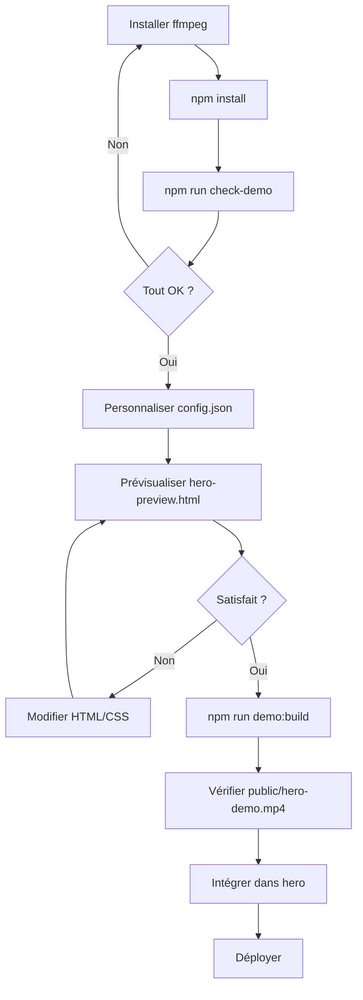

# 🎬 Synthèse : Système de Démo Hero Comptalyze

## ✅ Ce qui a été créé

### 📂 Fichiers principaux

| Fichier | Description | Taille |
|---------|-------------|--------|
| **demo/hero-preview.html** | Page de démo autonome avec animations | ~11 Ko |
| **scripts/render-preview.mjs** | Enregistrement Puppeteer → MP4 + GIF | ~6 Ko |
| **scripts/trim-and-gif.mjs** | Variante depuis vidéo existante | ~5 Ko |
| **scripts/optimize-gif.mjs** | Optimisation GIF avec gifsicle | ~2 Ko |
| **scripts/check-demo-deps.mjs** | Vérification dépendances | ~4 Ko |
| **scripts/config.json** | Configuration centralisée | ~300 B |

### 📚 Documentation

| Fichier | Public cible | Contenu |
|---------|--------------|---------|
| **QUICKSTART_DEMO.md** | Débutant | Démarrage rapide (5 min) |
| **GUIDE_DEMO_HERO.md** | Intermédiaire | Guide complet + troubleshooting |
| **DEMO_COMPLETE.md** | Avancé | Documentation exhaustive |
| **DEMO_HERO_README.txt** | Tous | Référence ultra-rapide |
| **demo/README.md** | Développeur | Détails techniques |
| **demo/integration-examples.html** | Développeur | 7 exemples copy-paste |

### 🧩 Composants

| Fichier | Description |
|---------|-------------|
| **demo/HeroDemo.example.tsx** | 5 variantes de composant React |
| | • HeroDemo (basique) |
| | • HeroDemoWithControls |
| | • HeroDemoResponsive |
| | • HeroDemoGradient |
| | • HeroSection (exemple complet) |

### ⚙️ Configuration

| Élément | Valeur | Modifiable |
|---------|--------|------------|
| Durée | 15 secondes | ✅ `config.json` |
| Résolution | 1280×720 (16:9) | ✅ `config.json` |
| Framerate | 24 fps | ✅ `config.json` |
| Couleur principale | #0b5cff | ✅ `config.json` |
| Police | Poppins | ✅ `hero-preview.html` |
| Taille MP4 max | 8 Mo | ✅ `config.json` |
| Taille GIF max | 2 Mo | ✅ `config.json` |

### 📦 Commandes npm ajoutées

```json
{
  "check-demo": "node scripts/check-demo-deps.mjs",
  "demo:record": "node scripts/render-preview.mjs",
  "demo:optimize": "node scripts/optimize-gif.mjs",
  "demo:build": "npm run demo:record && npm run demo:optimize",
  "demo:fromRaw": "node scripts/trim-and-gif.mjs"
}
```

### 📦 Dépendances npm ajoutées

```json
{
  "devDependencies": {
    "puppeteer": "^23.11.1",
    "mime-types": "^2.1.35"
  }
}
```

## 🎯 Workflow complet



## 📊 Timeline de l'animation

```
0s ───────────────────────────────────────────── 15s
│         │     │           │         │         │
│ Input   │ Btn │ Results   │ Chart   │ URSSAF  │ Loop
│ typing  │ +   │ fade-in   │ animate │ show    │ fade
│         │ load│ stagger   │ bars    │         │
```

### Détail par phase

| Phase | Durée | Éléments | Animations |
|-------|-------|----------|------------|
| **1. Input** | 0-2s | Champ CA | Cursor blink → typing "3 000 €" |
| **2. Button** | 2-3s | Bouton "Calculer" | Click → loader rotatif |
| **3. Results** | 3-7s | 3 tuiles | Fade-in + scale avec stagger |
| | | • Cotisations : 660 € | Delay 0ms |
| | | • Revenu net : 2 340 € | Delay 150ms |
| | | • Badge "À jour ✅" | Delay 300ms |
| **4. Chart** | 7-10s | Graphique 2 barres | Height 0% → target avec bounce |
| | | Badge "+12%" | Apparition simultanée |
| **5. URSSAF** | 10-12s | Encadré + bouton | Fade-in + scale |
| **6. Loop** | 12-15s | Tous éléments | Fade-out progressif |

## 🎨 Design System

### Palette de couleurs

```css
/* Comptalyze Brand Colors */
--primary:      #0b5cff;  /* Bleu principal (boutons, accents) */
--primary-dark: #0a4fd9;  /* Hover states */

--text-title:   #0b1220;  /* Titres, valeurs importantes */
--text-body:    #1f2937;  /* Texte normal */
--text-muted:   #6b7280;  /* Labels, hints */

--bg-white:     #ffffff;  /* Fond principal */
--bg-card:      #f6f8ff;  /* Fond des cartes */
--bg-border:    #e6e9f5;  /* Bordures subtiles */

--success:      #10b981;  /* Indicateurs positifs */
```

### Typographie

```css
font-family: 'Poppins', -apple-system, BlinkMacSystemFont, 'Segoe UI', sans-serif;

/* Tailles */
--text-xs:  12px;  /* Labels, helper text */
--text-sm:  14px;  /* Texte secondaire */
--text-base: 16px; /* Texte normal, boutons */
--text-lg:  18px;  /* Sous-titres */
--text-2xl: 24px;  /* Input, valeurs */
--text-5xl: 48px;  /* Titres principaux */

/* Weights */
--font-normal:    400;
--font-medium:    500;
--font-semibold:  600;
--font-bold:      700;
```

### Espacements

```css
--spacing-2:  8px;   /* Gap serré */
--spacing-3:  12px;  /* Gap normal */
--spacing-4:  16px;  /* Gap moyen */
--spacing-6:  24px;  /* Gap large */
--spacing-8:  32px;  /* Padding cards */

--radius-lg:  12px;  /* Cards, inputs */
--radius-xl:  16px;  /* Containers */
--radius-full: 9999px; /* Pills, badges */
```

## 🚀 Guide d'utilisation ultra-rapide

### Installation (première fois)

```bash
# 1. Installer ffmpeg
choco install ffmpeg  # Windows
brew install ffmpeg   # macOS
sudo apt install ffmpeg  # Linux

# 2. Installer dépendances npm
npm install

# 3. Vérifier
npm run check-demo
```

### Génération

```bash
# Générer tout (recommandé)
npm run demo:build

# OU depuis votre vidéo
npm run demo:fromRaw captures/dashboard.mp4
```

### Intégration

```tsx
// Copier dans votre hero
<video
  className="w-full rounded-2xl shadow-2xl"
  autoPlay muted loop playsInline
  aria-label="Démo de Comptalyze"
>
  <source src="/hero-demo.mp4" type="video/mp4" />
</video>
```

## 📦 Sorties générées

| Fichier | Format | Résolution | Poids | Codec |
|---------|--------|------------|-------|-------|
| **public/hero-demo.mp4** | MP4 | 1280×720 | 6-8 Mo | H.264 (yuv420p) |
| **public/hero-demo.gif** | GIF | 1280×720 ou 960×540 | 1.5-2 Mo | GIF89a optimisé |
| public/palette.png | PNG | Variable | ~1 Ko | Temporaire (auto-supprimé) |

### Critères de qualité

**MP4** :
- ✅ CRF 23 (qualité optimale pour web)
- ✅ Preset medium (compromis vitesse/qualité)
- ✅ Fast start (streaming web)
- ✅ yuv420p (compatibilité universelle)

**GIF** :
- ✅ Palette 128 couleurs
- ✅ Dithering Bayer scale 3
- ✅ Lossy 80% (si gifsicle)
- ✅ Auto-resize si > 2 Mo

## 🎓 Documentation de référence

### Pour démarrer rapidement

1. **DEMO_HERO_README.txt** : Référence ultra-rapide (1 page)
2. **QUICKSTART_DEMO.md** : Guide 5 minutes

### Pour approfondir

3. **GUIDE_DEMO_HERO.md** : Guide complet + troubleshooting
4. **DEMO_COMPLETE.md** : Documentation exhaustive

### Pour développer

5. **demo/README.md** : Détails techniques de l'animation
6. **demo/integration-examples.html** : 7 exemples copy-paste
7. **demo/HeroDemo.example.tsx** : 5 composants React

## 🎯 Cas d'usage

### Cas 1 : Démo simulée (automatique)

**Contexte** : Vous n'avez pas encore de dashboard fonctionnel

```bash
npm run demo:build
```

✅ Génère une démo factice mais réaliste  
✅ Idéal pour landing page avant lancement  
✅ 100% contrôlé et reproductible  

### Cas 2 : Depuis capture réelle

**Contexte** : Vous avez capturé votre vrai dashboard

```bash
npm run demo:fromRaw captures/mon-dashboard.mp4
```

✅ Extraction automatique du meilleur segment  
✅ Ajout d'overlay "Comptalyze"  
✅ Optimisation identique  

### Cas 3 : Personnalisation avancée

**Contexte** : Vous voulez modifier l'animation

```bash
# 1. Modifier demo/hero-preview.html
# 2. Prévisualiser
npx serve .
# → http://localhost:3000/demo/hero-preview.html

# 3. Regénérer
npm run demo:build
```

## 🔧 Personnalisation rapide

### Changer la couleur principale

```json
// scripts/config.json
{
  "primaryColor": "#8b5cf6"  // Violet au lieu de bleu
}
```

### Changer les valeurs affichées

```html
<!-- demo/hero-preview.html -->
<input placeholder="Ex. 5 000 €" />
<div class="result-value">1 100 €</div>  <!-- Cotisations -->
<div class="result-value">3 900 €</div>  <!-- Net -->
```

### Changer la durée

```json
// scripts/config.json
{
  "durationSec": 12  // Au lieu de 15
}
```

### Changer le texte

```html
<!-- demo/hero-preview.html -->
<div class="urssaf-title">
  Déclaration en 1 clic  <!-- Au lieu de "Pré-remplissage URSSAF" -->
</div>
```

## ✅ Checklist finale

Avant de déployer :

- [ ] `npm run check-demo` passe au vert
- [ ] MP4 < 8 Mo (`ls -lh public/hero-demo.mp4`)
- [ ] GIF < 2 Mo (`ls -lh public/hero-demo.gif`)
- [ ] Vidéo testée sur Chrome, Firefox, Safari
- [ ] Attributs `autoPlay`, `muted`, `loop`, `playsInline`
- [ ] `aria-label` descriptif
- [ ] Poster image créé (optionnel)
- [ ] Performance OK (Lighthouse > 90)

## 🐛 Troubleshooting rapide

| Problème | Solution |
|----------|----------|
| "ffmpeg non reconnu" | Installer ffmpeg et ajouter au PATH |
| "MP4 > 8 Mo" | Augmenter CRF (ligne 109 render-preview.mjs) |
| "GIF > 2 Mo" | Script réduit auto, sinon réduire durée |
| "Puppeteer plante" | `npm install puppeteer --force` |
| "Animation trop rapide" | Multiplier les setTimeout dans hero-preview.html |

## 📈 Performance attendue

| Métrique | Valeur cible | Comment mesurer |
|----------|--------------|-----------------|
| **LCP** | < 2.5s | Lighthouse, Web Vitals |
| **CLS** | < 0.1 | Utiliser aspect-ratio |
| **FCP** | < 1.8s | Lazy load si below fold |
| **Taille MP4** | 6-8 Mo | `ls -lh public/hero-demo.mp4` |
| **Taille GIF** | 1.5-2 Mo | `ls -lh public/hero-demo.gif` |

## 🎉 Prochaines étapes

1. **Installation** : `npm install` + installer ffmpeg
2. **Vérification** : `npm run check-demo`
3. **Génération** : `npm run demo:build`
4. **Intégration** : Copier snippet dans hero
5. **Test** : Chrome, Firefox, Safari
6. **Déploiement** : Push to production

---

**Temps estimé total : 10-15 minutes (première fois)**  
**Régénérations suivantes : 2-3 minutes**

✨ **Vous êtes prêt !** Lancez `npm run demo:build` et obtenez vos fichiers optimisés en quelques minutes.


